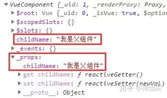

# 白话版

## 序言

* 父组件 怎么传值给 子组件的 props
* 子组件如何读取props
* 父组件 data 更新，子组件的props 如何更新

## Demo
```vue
<div class="a" >
    <testb :child-name="parentName" ></testb>
</div>
```
此处父组件的 data：**this.parentName** 传入给了 子组件 testb 的 **child-name** 属性

* 流程图如下

  ```flow
  st=>start: 更新数据
  op1=>operation: 父组件编译渲染函数，将props渲染为子组件的attrs
  op2=>operation: 子组件从attrs中读取props复制到_props，并设置响应式
  op3=>operation: parentName数值更新
  op4=>operation: 通知父组件重新渲染
  e=>end
  st->op3->op4->op1->op2->e
  ```

##  问题1、父组件 怎么传值给 子组件的 props
### ① 父组件的模板解析为渲染函数
```js {8}
(function() {    
  with(this){  
    return _c('div',{ 
        staticClass : "a"
      }, [
        _c('testb', {
          attrs:{
            "child-name": parentName   // 这里直接把parentName作为attr传进去
          }
        })
      ], 1)
  }
})
```
- 实际最后的属性类似这样
``` js 
{ attrs: { child-name: "我是父组件" } }
```

### ② 子组件保存 从attrs里提取 props 并设置响应式
- 子组件最后的 attrs 包含 普通属性 和 props，所以需要筛选出 props，然后保存起来
- 筛选后的 props 放入了 _props 中，并设置响应式，如下图
- 

*注意，这里的响应式指的是子组件的Vue实例中，属性_props下的属性childName设置了get和set，而父组件的数据parentName的响应式是设置在父组件的vue实例中，因此改变childName不会改变parentName，因为根本不是一个属性，get和set是分开的*

## 问题2、组件如何读取props

- 一般读取属性是采用 this.childName 这种形式读取的，这是因为vue对组件实例的这些属性设置了getter 和 setter，实际读取的是_props的数据

- 以 childName为例

```js
  Object.defineProperty(testb, 'childName', {    // 设置testb组件的childName的属性
      get() {        
          return this._props.childName   // get 的时候返回_props中的对应数据
      },    

      set(val) {          
          this._props.childName = val   // set 的时候设置_props中的对应数据
      }
  });
```

 *再次强调，这里的 this 是子组件的实例，childName 是在子组件的 _props 中，而 parentName 是在父组件的_props 中，修改子组件的childName对父组件的属性不会产生影响*

## 问题3、父组件 data 更新，子组件的props 如何更新

* 比如，此刻我修改了 parentName ，子组件的更新会走以下流程

  * 1. parentName 通知监听了这个属性的页面（或者组件），我更新了

    2. 父组件接收到通知，更新渲染函数，也就是以下的渲染函数
       ```js
       (function() {    
         with(this){  
           return _c('div',{ 
               staticClass : "a"
             }, [
               _c('testb', {
                 attrs:{
                   "child-name": parentName   // 这里直接把parentName作为attr传进去
                 }
               })
             ], 1)
         }
       })
       ```

       *PS：Vue会对编译好的渲染函数缓存，更新的时候直接读取这个缓存*
    3. 然后执行渲染函数，就回到了问题1的步骤
# props源码版

## 初始化

```js
function Vue(){
    ... 其他处理
    initState(this)
    ...解析模板，生成DOM 插入页面
}

function initState(vm) {    
    var opts = vm.$options;    
    if (opts.props) {
      // 初始化props
      initProps(vm, opts.props);
    }
    ... 处理 computed，watch，methods 等其他options
}
```

## initProps

```js
function initProps(vm, propsOpt) {    
   // 这是父组件给子组件传入的 props 的具体值
   var propsData = vm.$options.propsData || {};    
   var props = vm._props = {};    
   for (var key in propsOpt){        
       // 给 props 的 key 设置 响应式
       defineReactive(props, key,  propsData[key]);        
       if (!(key in vm)) {            
           // 转接访问，访问 vm 属性，转到访问 vm._props 属性
           proxy(vm, "_props", key);
       }
   }
}
```

上面的代码主要做了三件事

1. 遍历 props

2. 给 props 设置响应式

3. 给 props 设置代理

## 给 props 设置响应式

**如果props 是基本类型**

在 子组件实例上设置这个 props 属性为响应式，跟 data 本质一样，作用是监听 props 修改

**如果 props 是对象**

也会在 子组件实例上 设置这个 props 属性为响应式，作用也是监听 props 修改

**但是！**

**【不会递归对象】**给对象内所有属性设置响应式，因为该对象**【已经在父组件中】**完成响应式设置了

```js
function observe (value, asRootData) {
  var ob;
  // 已经设置过响应式，直接取__ob__
  if (hasOwn(value, '__ob__') && value.__ob__ instanceof Observer) {
    ob = value.__ob__;
  } else
    // 对属性的遍历在这里，new Observer里的 walk
	  ...
  return ob
}
```

**也就是说**

如果在子组件中直接修改 props 对象内的数据，父组件也会跟着修改（因为数据已经添加了dep）

## 当 父组件数据 改变，子组件怎么更新

### 基本类型

父组件数据改变，只会把新的数据传给子组件

子组件拿到新数据，就会直接替换到原来的 props

updateChildComponent 是子组件内部更新时会调用到的一个函数,这是其中更新 props 的一个片段

```js
function updateChildComponent(vm, propsData) {    
    if (propsData && vm.$options.props) {        
      // 保存 props 的地方，用于访问转接
      var props = vm._props;        
      // 所有子组件上设置的 props 的 key
      var propKeys = vm.$options._propKeys || [];        
      for (var i = 0; i < propKeys.length; i++) {            
        var key = propKeys[i];
        props[key] = propsData[key] // 这里会触发defineReactive里面的setter
      }
     vm.$options.propsData = propsData;
   }
}
```

而 props 在子组件中也是响应式的，【直接 等号 替换】导致触发 set，set 再通知 子组件完成更新

watcher1 是父组件，watcher2 是子组件

父组件内的 data num 通知 watcher1 更新
子组件内的 props child_num 通知 watcher2 更新

### 对象类型

**区别是什么？**

1、基本类型是，子组件内部 props 通知 子组件更新的

2、引用类型是，父组件的数据 data 通知 子组件更新的

**例子**

父组件设置 obj 对象，并传给子组件，5秒后负责 notify 的是 message 的 dep

```js
var subComponent = {
    template: '<div>{{ obj.message }}</div>',
    props: ['obj']
}

var app = new Vue({
    el: '#app',
    template: '<subComponents :obj="obj"></subComponents>',
    components: { subComponents: subComponent },
    data: {
        obj: {
            message: 'Hello Vue！'
        }
    },
    mounted () {
        setTimeout(() => {
            this.obj.message = 'ss'
        }, 5000)
    }
})
```

## 设置代理

```js
proxy(vm, "_props", key);

// 这是一个通用的代理方法，data 时将key换为_data: proxy(vm, "_data", key)
function proxy(target, sourceKey, key) {
  Object.defineProperty(target, key, {
      get() {            
          return this[sourceKey][key]
      },
      set(val) {            
          this[sourceKey][key] = val;
      }
  });
}
```

