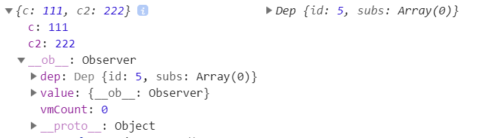

## 一些对象说明

Watcher：每个Vue实例、Computed、Watcher 都会有自己的Watcher，相当于观察者，负责update

Dep：每个属性用来收集观察者的对象，相当于主题，负责notify

## 大体流程图


## 初始化监听

```js
Vue.prototype._init=function(){
    ...
    initState(this) // 这个方法会初始化 props、data 等的监听
    ...
}
```

**以Data为例**

```js
function initData(vm) {  // 在 initState 中调用
    var data = vm.$options.data;
    data = typeof data === 'function' ? data.call(vm, vm) : data || {};
    // ... 重名检测，合规检测，代理访问等代码
    observe(data, true /* asRootData */); // 遍历 data ，添加响应式
}

function observe (value, asRootData) {
  ...
  ob = new Observer(value); // value 就是 data（即 data () {} 返回的对象）
  ...
  return ob
}

function Observer(value) {    
    var keys = Object.keys(value);
    // ...被省略的代码
    for (var i = 0; i < keys.length; i++) {
      	// 重点！！！遍历属性添加响应
        defineReactive(obj, keys[i]);
    }
};
```

## 基本数据类型的监听

**核心：defineReactive**

```js
function defineReactive(obj, key) {    
  // dep 用于收集所有观察者(Watcher)
  var dep = new Dep();    
  var val  = obj[key]
  Object.defineProperty(obj, key, {        
    enumerable: true,
    configurable: true,
    get() {
      if (Dep.target) { // 指向此时访问该属性的 Watcher
        // 收集依赖，depend 最后实际调用 addSub，也就是将 Watcher 添加到观察者列表中
        dep.depend(Dep.target)
      }
      return val
    },
    set() { ....依赖更新，源码下篇文章放出 }
  });
}

var Dep = function Dep () {
  this.id = uid++; // Dep Id，用于过滤
  this.subs = []; // 观察者列表
};

Dep.prototype.addSub = function addSub (sub) {
  this.subs.push(sub);
};
```

## 对象类型的监听

### defineReactive

定义响应式的 getter 和 setter

```js
function defineReactive (
 obj,
 key,
 val,
 customSetter,
 shallow
) {
  var dep = new Dep();
  var childOb = !shallow && observe(val); // 在observe 递归给属性增加响应式
  Object.defineProperty(obj, key, {
    enumerable: true,
    configurable: true,
    get: function reactiveGetter () {...},
    set: function reactiveSetter (newVal) {}
  });
}
```

### observe()

```js
function observe (value, asRootData) {
  if (!isObject(value) || value instanceof VNode) {
    return
  }
  ...
  ob = new Observer(value); // value 是值为对象的属性
  ...
  return ob
}
```

### Observer

给对象设置 dep 和 `__ob__`，并调用递归方法给下属的属性增加响应式

```js
var Observer = function Observer (value) {
    this.dep = new Dep();
    def(value, '__ob__', this); // 给对象类型的属性增加一个__ob__的属性，值就是这个Observer
    if (Array.isArray(value)) {
        ... 数组的处理
    } else {
        this.walk(value);       // 递归地给所有属性增加响应式
    }
};
```

### walk

递归地给所有属性增加响应式

```js
Observer.prototype.walk = function walk (obj) {
    var keys = Object.keys(obj);
    for (var i = 0; i < keys.length; i++) {
        defineReactive$$1(obj, keys[i]); // 递归地给所有属性增加响应式
    }
};
```

再回到`defineReactive`理解注释

```js
function defineReactive (
 obj,
 key,
 val,
 customSetter,
 shallow
) {
  var dep = new Dep();
  var childOb = !shallow && observe(val); // 在observe 递归给属性增加响应式
  Object.defineProperty(obj, key, {
    enumerable: true,
    configurable: true,
    get: function reactiveGetter () {
      ...
      if (Dep.target) {
        dep.depend();
        if (childOb) { // 当属性值为对象时，childOb 不为 undefined，而是该对象的 __ob__
          childOb.dep.depend(); // 对象的 dep 是 __ob__ 里的 dep，与闭包里的不一样
          /*
          	其实这里的 dep 和 childOb.dep 都是监听同一个对象属性
          	this.xxx = {} 时只有 dep 会 notify
          	childOb.dep 是给对象添加不存在的属性时，以及操作数组时调用的
          */
          ... 数组的
        }
      }
      return value
    },
    set: function reactiveSetter (newVal) {}
  });
}
```

- 举个例子

```js
data () {
	return {
    child: {
      c: 111,
      c2: 222
    }
  }
}
```

这里 obj 就会增加一个 `__ob__`的属性，在通知更新的时候使用，且对象的 dep 是 `__ob__ `里的 dep，与闭包里的（id为5）不一样



并且各属性的 dep 也是不一样的（一个 id 为6，一个id为7）


## 数组类型的监听

主要区别在`defineReactive`和`Observer`

```js
function defineReactive (
 obj,
 key,
 val,
 customSetter,
 shallow
) {
  var dep = new Dep();
  var childOb = !shallow && observe(val); // observe里new Observer
  Object.defineProperty(obj, key, {
    enumerable: true,
    configurable: true,
    get: function reactiveGetter () {
      ...
      if (Dep.target) {
        dep.depend();
        if (childOb) {
          childOb.dep.depend();
          if (Array.isArray(value)) {
            dependArray(value);
          }
        }
      }
      return value
    },
    set: function reactiveSetter (newVal) {}
  });
}

function dependArray (value) {
  // 把源代码按一般的习惯整理了下
  for (let i = 0; i < value.length; i++) {
    let e = value[i];
    // 子项是对象的时候，收集依赖进该对象的dep.subs
    e && e.__ob__ && e.__ob__.dep.depend(); // 访问数组时，子项的 e.__ob__.dep 也收集Watcher
    if (Array.isArray(e)) {
      dependArray(e);
    }
  }
}
```

```js
var Observer = function Observer (value) {
  this.value = value;
  this.dep = new Dep();
  def(value, '__ob__', this);
  if (Array.isArray(value)) {
    ...
    this.observeArray(value);
  }
};

Observer.prototype.observeArray = function observeArray (items) {
  for (var i = 0, l = items.length; i < l; i++) {
    observe(items[i]); // 遍历数组的每一项，如果是对象或数组，继续递归添加响应式
    /*
    注意，this.arr[1] = xxx 不会响应，不管是对象还是基本类型
    如果是基本类型，这里items[i]不会添加响应式的
    如果是对象，虽然添加了__ob__，但是set时是闭包的dep进行notify，因此this.arr[1] = xxx 不会响应
    但对对象的属性进行修改会响应
    */
  }
};
```

- 举个例子

```js
  data: {
    arr: [1, { // 修改这个对象不行
      arrSubObj: { // 修改arrSubObj能响应
        c: 1 
      }
    }]
  }
```


需要调用 Vue 重写的方法才能触发

- push、splice

  ```js
  var original = Array.prototype.push;
  Array.prototype.push = function() {    
      var args = [],
      len = arguments.length;    
      while (len--) args[len] = arguments[len]; // 复制 传给 push 等方法的参数
      var result = original.apply(this, args); // 执行 原方法 
      var ob = this.__ob__;    
      ob.dep.notify(); // 注意这里取的是数组的__ob__里的dep
      return resul
  }
  ```
